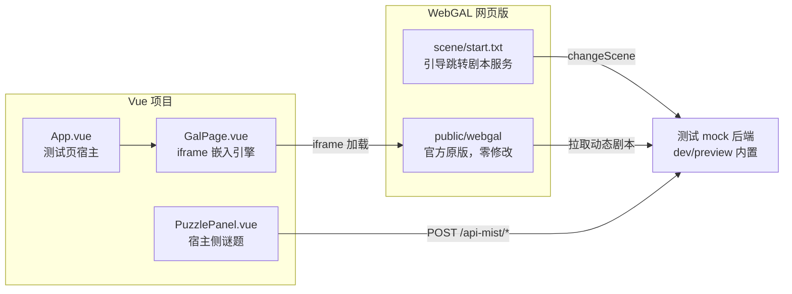

# mistarg2anns — WebGAL × Vue 集成测试页（不魔改版）

按《WebGAL-Vue集成流程-不魔改版》实现的测试版网页：动态剧本流（方案 1）+ 宿主 UI 层交互（方案 4）。

## 架构



核心：剧本逐段下发。引擎每次「切场景」就是一次后端请求，分支由后端决定。

## 目录说明

| 路径 | 说明 |
|---|---|
| `webgal-game/` | 仓库自维护的游戏内容（config.txt / start.txt / scene/*.txt / flowchart.json） |
| `public/webgal/` | 生成物（gitignore）：官方网页版发行包 + webgal-game 覆盖，由 `fetch:webgal` 拉取 |
| `scripts/fetch-webgal.mjs` | 从 GitHub Releases 拉取官方发行包（非源码），dev/build/preview 前自动执行 |
| `public/webgal/game/scene/start.txt` | 引擎固定入口（4.6.4 版从 scene 目录启动），仅一句 `changeScene:entry.txt;` |
| `src/components/GalPage.vue` | iframe 宿主，提供「重新加载引擎」+ 答案捕获中转 |
| `src/components/PuzzlePanel.vue` | 方案 4 宿主驱动演示 |
| `vite.config.js` | 内置 mock 后端（拦截 game/scene 测试剧本 + /api-mist 状态接口） |

注：

- 引擎本体不下源码、不入库：`public/webgal/` 是官方 Release 的 web 构建产物，
  首次运行 dev/build/preview 时自动拉取（约 71 MB），版本由 package.json 的
  `webgalVersion` 固定；手动强制刷新：`pnpm fetch:webgal -- --force`
- `game/start.txt`（game 根目录）在本引擎版本中不是启动场景，已同步为同一句内容

## 运行测试

在子项目内启动（端口与 `projects.json` 的 `devPort=5176` 一致）：

```sh
pnpm dev
```

或在仓库根目录：

```sh
pnpm proj:dev mistarg2anns
```

打开 `http://localhost:5176/mistarg/2anns/`。

首次运行会自动拉取官方 WebGAL 发行包（GitHub Releases，约 71 MB，随后缓存跳过）；
网络受限时可用环境变量 `WEBGAL_RELEASE_URL` 指定镜像下载地址。

## 测试路径（剧本驱动，方案 1）

1. 引擎标题页点击开始 → 启动场景 `scene/start.txt` 仅一句跳转 `entry.txt`
2. dev/preview 中 mock 后端拦截 `game/scene/*.txt` 请求，按状态动态下发剧本
3. `choose` 选择左右路 → 选项值即后端剧本名（引擎会预加载选项目标）
4. `puzzle.txt` 内 `getUserInput` 采集答案 → 宿主捕获后 `POST /api-mist/submit-answer`
5. 后端判定：`42` 答对 → 重载 iframe → `entry` 下发「已解锁」分支 → `ending.txt` 闭环；
   答错 → `entry` 下发「再想想」分支 → 回到 `puzzle.txt` 重试

## 测试路径（宿主驱动，方案 4）

- 自动：上述第 4、5 步即宿主驱动——答案由 Vue 宿主从同源 iframe 捕获并提交后端，
  后端更新状态后重载 iframe，`entry` 按新状态下发对应分支
- 手动：右侧「宿主侧谜题」面板点击「模拟在宿主演算并标记已解」→
  `POST /api-mist/mark-puzzle-solved` → 重载 iframe → 后端直接下发「已解锁」分支

## Mock 后端接口（仅 dev / preview 生效）

| 接口 | 作用 |
|---|---|
| `GET …/scene/entry.txt` | 开场剧本，按后端状态分支（未解 / 答错 / 已解） |
| `GET …/scene/left.txt` / `right.txt` | choose 分支剧本 |
| `GET …/scene/puzzle.txt` | getUserInput 采集答案 |
| `GET …/scene/check.txt` | 判定过渡剧本（带 answer 参数时后端直接判题） |
| `GET …/scene/ending.txt` | 结局 |
| `GET /api-mist/status` | 查询后端状态 |
| `POST /api-mist/submit-answer` | 宿主提交答案，后端判定 |
| `POST /api-mist/mark-puzzle-solved` | 宿主标记谜题已解 |

mock 后端在 `vite.config.js` 的 `mockStoryServer()` 中实现，通过
`configureServer` / `configurePreviewServer` 挂载，`pnpm preview` 同样可用。

## 与正式后端对接

- `changeScene` 支持 `http(s)://` 完整 URL：把 `public/webgal/game/scene/start.txt` 改成
  `changeScene:https://你的后端/story/entry.txt;`（URL 必须以 `.txt` 结尾），即可切到真实后端
- 实测注意（引擎 4.6.4）：`choose` 的目标不能是完整 URL（解析器按「:」截断）；
  `changeScene` 不做 `{变量}` 插值。真实后端场景下 choose 目标需改用本地场景名
  （后端拦截）或切换到魔改版的 `request` 语句
- 删除 `vite.config.js` 中的 `mockStoryServer()` 即可移除测试 mock
- `/api-mist` 前缀与 `projects.json` 的 `proxyApi` 对齐，配置 `.env.development` 的
  `API_PROXY_TARGET` 后 dev 代理会转发到真实后端
- 静态托管无后端时：`game/scene/` 下的同名 `.txt` 本地场景作为回退剧本（引擎内 `jumpLabel` 判题），
  保证页面可演示；动态版与回退版剧本需分别维护
- 跨域部署时后端需允许前端站点 origin（CORS），剧本响应带 `Access-Control-Allow-Origin`

## 已知限制（不魔改的固有代价，均经实测）

- `choose` 选项目标不能是完整 URL：解析器按「:」截断（4.6.4 实测），URL 目标需魔改或换版本
- `changeScene` 不做 `{变量}` 插值（4.6.4 实测）：变量进不了 URL，答案由宿主中转（本测试版方案）
- 远程剧本必须是 `http(s)://` 完整 URL 且以 `.txt` 结尾（`changeScene` 支持）
- 引擎启动场景固定为 `game/scene/start.txt`（本版本行为）
- 每次交互 = 一次场景切换，有轻微加载感
- 答案等数据走 GET query，仅测试用；正式接入敏感信息请改用后端 Cookie + getUserInput 登录
- 静态回退版与动态版剧本内容需分别维护（`game/scene/*.txt` 与 `vite.config.js`）
